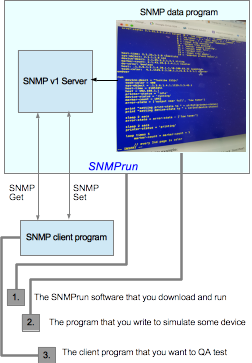

# SNMPrun simulator



## What does this project do?
This program provides an SNMP version 1 server using the PromonLogicalis SNMP server library, but with an interpreter to run a program to control the setting of OIDs. One can run the snmprun command on a user provided simple program that specifies the SNMP variables, their types and object IDs and how they change over time. The language includes the basic SNMP types of string, integer, counter, oid, timeticks, guage, and ipaddress. It also adds a variant of string which implements a bitset. It provides identifiers for user definable integer and bitset values (like enums). The language has the control flow statements of conditionals (if, elseif, else) and loops (infinite, conditional, fixed number of times). It allows variable initialization from the command flags or from stdin prompting. It allows ongoing input via setting of SNMP variables externally and reading/blocking on the values in the program.

## Why is this project useful?
This software is useful because it makes it very simple to get an SNMP server up and running with the SNMP OIDs that you want to simulate and a program to modify them over time. For example, one can write a program to export the SNMP state about a printer, such as the page counter metrics, printer error state, and printer model name. The printer information can then vary over time as the printer prints more pages and changes error states (e.g. "low paper"). With this software, one is able to write a simple simulation focussing on the OIDs of interest. Other simulators often work off SNMP dumps of the whole device and/or ways of having a set of dumps to allow variability of the OIDs. Although this is very useful, I don't feel this allows one to focus explicitly and compactly on the issues in testing SNMP client software. For instance, in the printer example, one can write a printer program which generates the abnormal case of a printer counter going to zero temporarily or going backwards.

## Simple example - Hello world

```
var
   hello: .1.2.3 string
endvar

run
   hello = "G'day, mate."
   print hello
   sleep 10 secs
endrun
```

Running the SNMP simulator and running the snmpwalk client program.

```
server>$ sudo ./snmprun examples/hello.sim
G'day, mate.

client>$ snmpwalk -c public -v1 localhost .1
iso.2.3 = STRING: "G'day, mate."
End of MIB
```


## Complex example - Printer printing pages with errors

```
var
  printer-status: 2.1.25.3.5.1.1.1 integer [1 = 'other', 2 = 'p-unknown', 3 = 'idle', 4 = 'printing',
                                        5 = 'warmup', ]
  device-status: 2.1.25.3.2.1.5.1 integer [1 = 'd-unknown', 2 = 'running', 3 = 'warning', 
                                       4 = 'testing', 5 = 'down' ]
  error-state: 2.1.25.3.5.1.2.1 bitset [0 = 'low paper', 1 = 'no paper', 2 = 'low toner',
                                   3 = 'no toner', 4 = 'door open', 5 = 'jammed',
                                   6 = 'offline', 7 = 'service requested', 
                                   8 = 'input tray missing',
                                   9 = 'output tray missing',
                                   10 = 'marker supply missing',
                                   11 = 'output near full',
                                   12 = 'output full',
                                   13 = 'input tray empty',
                                   14 = 'overdue prvent maint',]
  host-time: 2.1.25.1.1.0 timeticks
  sys-object: 2.1.1.2.0 oid
  device-desc1: 2.1.25.3.2.1.3.1 string
  marker-count: 2.1.43.10.2.1.4.1.1 counter
  do-color: boolean
  host: .1.3.6.1.2.1.4.20.1.1.10.100.63.22 ipaddress
  tosh-color:  4.1.1129.2.3.50.1.3.21.6.1.3.1.1 counter
endvar

run
    device-desc1 = "Toshiba 2555c"
    tosh-color = 400
    sys-object = .1.3.6.1.4.1.1129.2.3.45.1
    host-time = 21851051
    host = 192.168.1.1
    printer-status = 'idle'
    device-status = 'running'
    marker-count = 1042
    error-state = ['output near full', 'low toner']

    print "setting print-state to " + strInt(printer-status)
    print "setting device-state to " + strInt(device-status)

    sleep 2 secs
    error-state = error-state - ['low toner']

    sleep 2 secs
    printer-status = 'printing'

    loop times 5
        marker-count = marker-count + 1

        // every 2nd page is color
        if do-color
           tosh-color = tosh-color + 1
           do-color = false
        else
           do-color = true
        endif

        sleep 2 secs
    endloop

    error-state = error-state + ['low paper']
    printer-status = 'idle'

    sleep 10 secs
endrun
```

Running simulator example:
```
client>$ while true; do date; snmpwalk -c public -v1 localhost .1; sleep 2; done

Sat 13 Oct 2018 15:34:26 AEDT
SNMPv2-MIB::sysObjectID.0 = OID: SNMPv2-SMI::enterprises.1129.2.3.45.1
IP-MIB::ipAdEntAddr.10.100.63.22 = IpAddress: 192.168.1.1
HOST-RESOURCES-MIB::hrSystemUptime.0 = Timeticks: (21851051) 2 days, 12:41:50.51
HOST-RESOURCES-MIB::hrDeviceDescr.1 = STRING: Toshiba 2555c
HOST-RESOURCES-MIB::hrDeviceStatus.1 = INTEGER: running(2)
HOST-RESOURCES-MIB::hrPrinterStatus.1 = INTEGER: idle(3)
HOST-RESOURCES-MIB::hrPrinterDetectedErrorState.1 = Hex-STRING: 20 10 
SNMPv2-SMI::mib-2.43.10.2.1.4.1.1 = Counter32: 1042
SNMPv2-SMI::enterprises.1129.2.3.50.1.3.21.6.1.3.1.1 = Counter32: 400
End of MIB
```
